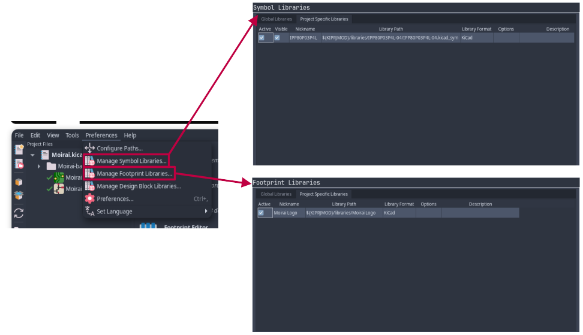

<p align="center">


</p>

Moirai is a 3-Channel majority voter for redundant flight computer systems made with KiCad. It allows you to properly implement redundant systems in hobby rockets whether they be high power or low power.

## Installation
1. Clone the repository:

```bash
git clone https://github.com/Zachary-Pearce/Moirai
```

2. Open the folder in KiCad and confirm the local libraries have been imported.



## Usage
> [!WARNING]
> Rocketry is a dangerous hobby, you are using this device at your own risk, incorrect usage may result in unexpected behaviour.

Before deciding to get this PCB for yourself, I reccomend that you read the full manual present in the wiki.

If you are going to get this PCB cut, I would reccomend using [JLCPCB](https://jlcpcb.com/), when creating your Gerber and Drill files, please follow the [relevant guide](https://jlcpcb.com/help/catalog/180-PCB-Files-Preparation) for your version of KiCad.

## Contributing
1. Fork this repository
2. Clone your fork
3. Make your changes
4. Submit a pull request

Ensure that your pull request includes the following:
- What has changed?
- Why has it changed?
- Proof testing has been carried out to ensure your changes work.